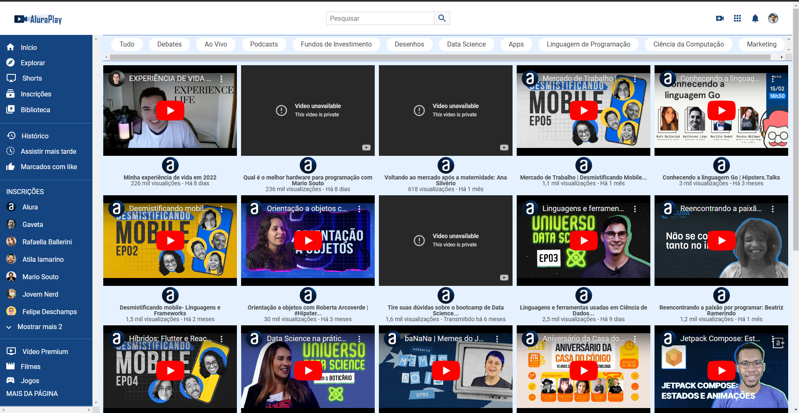

# Treinamento de Flexbox com HTML e CSS

Este repositório contém um projeto focado no **treinamento de disposição de elementos em páginas web** utilizando **Flexbox**. O objetivo principal foi aplicar os conhecimentos adquiridos no curso da [Alura](https://www.alura.com.br/) sobre Flexbox.

## Tecnologias Utilizadas

- **HTML5**
- **CSS3**

## Objetivo do Projeto

- Praticar e consolidar os conceitos de **Flexbox**.
- Desenvolver layouts responsivos e bem estruturados.
- Aperfeiçoar habilidades de design e organização de elementos em páginas web.

---

## Pré-visualização

  

---

📚 *Projeto desenvolvido como parte do aprendizado no curso da Alura.*
